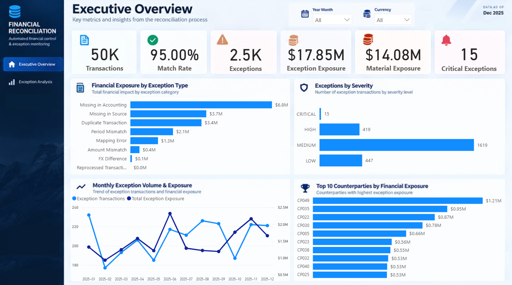
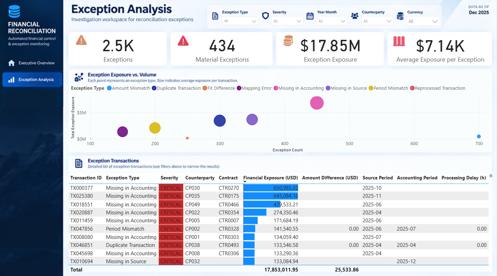
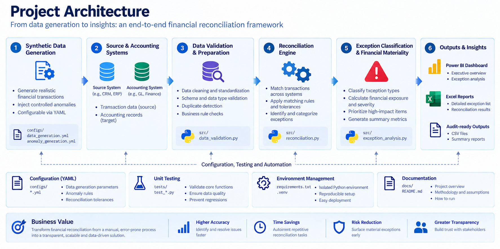

# Financial Reconciliation Framework

An end-to-end financial reconciliation and data quality framework built with Python, automated testing, Excel reporting, and Power BI.

The project simulates a real-world finance control process in which transaction records from an operational source system are reconciled against an accounting system. The framework automatically identifies discrepancies, classifies exceptions, calculates financial exposure, prioritizes material issues, and produces audit-ready analytical outputs.

> **Portfolio Project:** All data used in this repository is synthetic and was generated specifically for demonstration purposes. No proprietary or confidential company data is included.

---

## Project Overview

Financial reconciliation processes often require analysts to compare transactions across operational and accounting systems, investigate discrepancies, quantify financial impact, and communicate exceptions to Finance, Accounting, and Audit teams.

Manual reconciliation becomes increasingly difficult as transaction volumes grow.

This project demonstrates how that process can be transformed into a configurable and reproducible analytics workflow.

The framework:

- Generates realistic synthetic financial transactions
- Simulates source and accounting systems
- Injects controlled data anomalies
- Validates data quality and schema consistency
- Reconciles transactions across systems
- Classifies reconciliation exceptions
- Calculates financial exposure and severity
- Generates audit-ready outputs
- Produces an Excel exception report
- Provides interactive Power BI dashboards
- Validates core logic through automated tests

---

## Key Results

The current synthetic scenario processes **50,000 financial transactions** and intentionally introduces **2,500 reconciliation exceptions**.

| KPI | Result |
|---|---:|
| Transactions Reconciled | 50,000 |
| Matched Transactions | 47,500 |
| Exceptions | 2,500 |
| Match Rate | 95.00% |
| Exception Rate | 5.00% |
| Total Exception Exposure | $17.85M |
| Material Exceptions | 434 |
| Material Exposure | $14.08M |
| Critical Exceptions | 15 |

The results demonstrate an important reconciliation principle:

> **Exception frequency is not necessarily a proxy for financial risk.**

For example, amount mismatches represent the largest number of exceptions in the simulated dataset, while missing accounting records represent substantially greater financial exposure.

This distinction allows investigation efforts to be prioritized based on **materiality and business impact**, rather than exception count alone.

---

## Dashboard Preview

### Executive Overview

The Executive Overview provides a high-level view of reconciliation performance, financial exposure, severity distribution, monthly exception activity, and counterparty concentration.



It is designed to answer:

- How much of the population reconciled successfully?
- How many exceptions require investigation?
- What is the financial exposure associated with those exceptions?
- How much exposure is considered material?
- Which exception types create the greatest financial risk?
- Which counterparties concentrate the largest exposure?

---

### Exception Analysis

The Exception Analysis page provides a more detailed investigation workspace for reconciliation exceptions.



Analysts can investigate exceptions by:

- Exception type
- Severity
- Accounting period
- Counterparty
- Currency
- Financial exposure
- Amount difference
- Processing delay

The detailed transaction table provides a direct path from executive-level metrics to individual exceptions requiring investigation.

---

## Project Architecture

The framework separates data generation, validation, reconciliation, exception analysis, and reporting into distinct components.



The high-level workflow is:

```text
Synthetic Data Generation
          |
          v
Source System + Accounting System
          |
          v
Data Validation & Preparation
          |
          v
Reconciliation Engine
          |
          v
Exception Classification
          |
          v
Financial Exposure & Severity
          |
          v
+-------------------------------+
|                               |
v                               v
Excel Reporting            Power BI
|                               |
v                               v
Audit / Investigation      Analytics / Insights
```

This modular design separates business rules from implementation logic and makes the framework easier to test, maintain, and extend.

---

## Business Problem

Organizations frequently maintain related financial information across multiple systems.

Examples include:

- Operational platforms
- Policy or contract administration systems
- CRM platforms
- Billing systems
- ERP systems
- General ledger systems
- Finance databases

Differences can occur because of:

- Missing transactions
- Duplicate records
- Processing delays
- Incorrect mappings
- FX conversion differences
- Period allocation differences
- Reprocessing
- Amount inconsistencies

Without automated controls, analysts may need to manually compare large datasets and determine which differences require investigation.

The objective of this project is to automate that control process while maintaining transparency over the reconciliation rules and resulting exceptions.

---

## Reconciliation Process

The reconciliation engine performs the following logical workflow:

### 1. Load Transaction Data

Transaction records are loaded from the simulated source and accounting systems.

### 2. Validate Input Data

The framework checks expected schemas and required fields before reconciliation.

### 3. Detect Duplicates

Duplicate transaction IDs are identified before one-to-one comparison.

### 4. Match Transactions

Transactions are aligned across the source and accounting datasets using the configured transaction identifier.

### 5. Compare Financial Attributes

The engine evaluates fields including:

- Transaction amount
- Currency
- Accounting period
- Contract mapping
- Processing information

### 6. Apply Tolerances

Configured tolerances determine whether differences should be considered acceptable or classified as exceptions.

### 7. Classify Exceptions

Each transaction receives a reconciliation status based on the identified discrepancy.

### 8. Calculate Financial Exposure

The framework estimates the financial value associated with the exception using the available source or accounting transaction amount.

### 9. Assign Severity

Exceptions are categorized by materiality to support investigation prioritization.

### 10. Generate Outputs

The resulting dataset supports:

- Detailed exception investigation
- Excel reporting
- Power BI dashboards
- Audit and control analysis

---

## Exception Classification

The synthetic dataset contains the following exception categories:

| Exception Type | Description |
|---|---|
| `MATCHED` | Transaction successfully reconciled |
| `AMOUNT_MISMATCH` | Source and accounting amounts exceed the configured tolerance |
| `MISSING_IN_ACCOUNTING` | Transaction exists in the source system but not in accounting |
| `MISSING_IN_SOURCE` | Transaction exists in accounting but not in the source system |
| `DUPLICATE_TRANSACTION` | Transaction appears more than once where a unique record is expected |
| `FX_DIFFERENCE` | Difference associated with foreign exchange conversion |
| `PERIOD_MISMATCH` | Source and accounting records are assigned to different accounting periods |
| `MAPPING_ERROR` | Transaction is associated with inconsistent mapping information |
| `REPROCESSED_TRANSACTION` | Transaction shows characteristics of reprocessing |

The current scenario intentionally injects:

| Exception Type | Count |
|---|---:|
| Amount Mismatch | 700 |
| Missing in Accounting | 450 |
| Missing in Source | 350 |
| Duplicate Transaction | 300 |
| FX Difference | 250 |
| Period Mismatch | 200 |
| Mapping Error | 150 |
| Reprocessed Transaction | 100 |
| **Total** | **2,500** |

These anomalies are generated in a controlled way so that the expected results can be compared against the reconciliation engine output.

---

## Financial Materiality

Not every reconciliation exception carries the same level of financial risk.

The framework therefore calculates:

```text
Exception
    |
    +--> Exception Type
    |
    +--> Financial Exposure
    |
    +--> Severity
    |
    +--> Investigation Priority
```

This allows a high-volume, low-value exception category to be distinguished from a lower-volume category containing significant financial exposure.

For missing transactions, exposure is calculated using the amount available from the system where the transaction exists.

This prevents missing-side records from incorrectly receiving zero exposure.

---

## Configurable Business Rules

Business rules are stored in YAML configuration files rather than being embedded entirely in Python code.

```text
configs/
├── data_generation.yml
├── anomaly_generation.yml
└── reconciliation_rules.yml
```

Configuration controls include:

- Synthetic transaction volume
- Random seeds
- Date ranges
- Supported currencies
- Transaction types
- Number of injected anomalies
- Reconciliation tolerances
- Materiality thresholds
- Matching configuration
- Exception classification rules

This approach separates:

```text
Business Configuration
        from
Application Logic
```

and makes the framework easier to modify without rewriting the reconciliation engine.

---

## Synthetic Data Generation

Because financial transaction data is typically confidential, this repository does not use production company data.

Instead, the project contains a synthetic data generator capable of creating realistic financial transaction populations.

The current scenario generates:

- 50,000 transactions
- 500 contracts
- 50 counterparties
- 12 months of activity
- Multiple transaction types
- Multiple currencies

Transaction types include:

```text
PREMIUM
CLAIM
COMMISSION
```

Currencies include:

```text
USD
BRL
EUR
GBP
```

The generator creates a clean ground-truth population before controlled anomalies are injected into the simulated source and accounting datasets.

This creates a known expected result against which the reconciliation engine can be tested.

---

## Controlled Anomaly Injection

A dedicated anomaly-generation process introduces known discrepancies into the synthetic datasets.

The process is deterministic through configured random seeds.

This provides two important benefits:

**Reproducibility**

The same configuration produces predictable test scenarios.

**Validation**

Because the expected anomalies are known before reconciliation, the framework can verify whether the reconciliation engine correctly identifies them.

The generated anomaly manifest therefore acts as a form of reconciliation ground truth.

---

## Testing & Data Quality

Automated tests are used to validate both synthetic data generation and reconciliation behavior.

Tests cover areas such as:

- Expected anomaly counts
- Transaction uniqueness
- Schema consistency
- Exception classification
- Financial exposure
- Severity assignment
- Reconciliation totals
- Regression protection

The test structure separates different testing concerns:

```text
tests/
├── unit/
├── integration/
└── data_quality/
```

The goal is not only to produce reconciliation results, but to provide evidence that the underlying logic behaves as expected.

Tests can be executed with:

```bash
pytest
```

---

## Excel Exception Reporting

In addition to Power BI, the framework produces an audit-ready Excel report for operational investigation.

The workbook includes:

- Executive Summary
- Exceptions by Status
- Exceptions by Severity
- Detailed Exception List

This provides a familiar investigation format for Finance, Accounting, and Audit users who may need transaction-level data outside a BI environment.

---

## Technology Stack

| Area | Technology |
|---|---|
| Programming | Python |
| Data Processing | Pandas |
| Configuration | YAML |
| Testing | Pytest |
| Reporting | Excel / OpenPyXL |
| Visualization | Power BI |
| Data Formats | CSV |
| Version Control | Git / GitHub |
| Development | VS Code |
| Environment Management | Python virtual environment |

---

## Repository Structure

```text
financial-reconciliation-framework/
│
├── configs/
│   ├── data_generation.yml
│   ├── anomaly_generation.yml
│   └── reconciliation_rules.yml
│
├── dashboards/
│   ├── power_bi/
│   │   └── financial_reconciliation_dashboard.pbix
│   └── screenshots/
│       ├── executive_overview.png
│       └── exception_analysis.png
│
├── data/
│   ├── raw/
│   ├── processed/
│   └── sample/
│
├── docs/
│   ├── project_architecture.png
│   ├── architecture.md
│   ├── assumptions.md
│   ├── business_requirements.md
│   └── data_dictionary.md
│
├── outputs/
│
├── src/
│   ├── data_generation/
│   ├── ingestion/
│   ├── validation/
│   ├── reconciliation/
│   ├── reporting/
│   └── utils/
│
├── tests/
│   ├── unit/
│   ├── integration/
│   └── data_quality/
│
├── .gitignore
├── LICENSE
├── README.md
└── requirements.txt
```

---

## Getting Started

### 1. Clone the Repository

```bash
git clone <repository-url>
cd financial-reconciliation-framework
```

### 2. Create a Virtual Environment

Windows:

```bash
python -m venv .venv
.venv\Scripts\activate
```

macOS / Linux:

```bash
python3 -m venv .venv
source .venv/bin/activate
```

### 3. Install Dependencies

```bash
pip install -r requirements.txt
```

### 4. Generate Synthetic Transactions

```bash
python src/data_generation/generate_transactions.py
```

### 5. Inject Reconciliation Anomalies

```bash
python src/data_generation/inject_anomalies.py
```

### 6. Run the Reconciliation Engine

```bash
python src/reconciliation/reconciliation_engine.py
```

### 7. Run Automated Tests

```bash
pytest
```

> Commands above assume execution from the repository root.

---

## Main Outputs

The reconciliation engine generates a transaction-level result containing information such as:

```text
transaction_id
reconciliation_status
severity
financial_exposure_usd
amount_difference_usd
source_period
accounting_period
processing_delay
```

A typical run of the current configuration produces:

```text
Reconciliation completed successfully.

Transactions reconciled: 50,000
Matched: 47,500
Exceptions: 2,500
Match rate: 95.00%
```

The transaction-level output can then be consumed by the reporting and visualization layers.

---

## Business Insights

The synthetic scenario demonstrates several patterns commonly relevant to financial control processes.

### Financial risk is concentrated

A relatively small subset of exceptions accounts for a large share of total financial exposure.

### Frequency and materiality are different dimensions

The most frequent exception category is not necessarily the category representing the greatest financial exposure.

### Missing records can be financially significant

Transactions missing from one system can represent greater financial risk than small amount differences between otherwise matching records.

### Counterparty concentration matters

Aggregating exposure by counterparty helps identify where investigation efforts may have the greatest financial impact.

### Prioritization improves investigation efficiency

Combining exception type, financial exposure, and severity creates a more useful investigation queue than reviewing exceptions chronologically or solely by volume.

---

## Design Principles

The project was built around several engineering and analytics principles:

**Reproducibility**  
Synthetic data and anomaly generation use deterministic configuration.

**Separation of concerns**  
Generation, validation, reconciliation, reporting, and visualization are separate components.

**Configuration over hardcoding**  
Business parameters are externalized where appropriate.

**Testability**  
Known anomalies allow reconciliation logic to be validated against expected outcomes.

**Auditability**  
Exception results remain available at transaction level.

**Business relevance**  
Technical outputs are translated into financial exposure, severity, and investigation priorities.

---

## Documentation

Additional project documentation is available in the `docs/` directory:

- `business_requirements.md` — business objectives and functional requirements
- `assumptions.md` — modeling and reconciliation assumptions
- `data_dictionary.md` — dataset and field definitions
- `architecture.md` — technical architecture and component responsibilities

---

## Future Improvements

Potential extensions include:

- Aggregate and composite-key reconciliation
- Configurable multi-stage matching strategies
- Database-backed processing
- SQL reconciliation implementation
- Automated pipeline orchestration
- Structured application logging
- CI/CD with GitHub Actions
- Docker containerization
- Incremental reconciliation processing
- Historical exception tracking
- Automated alerting for material exceptions
- Cloud deployment
- Additional reconciliation scenarios

---

## Why This Project Matters

This project demonstrates more than a dashboard.

It combines:

```text
Financial Controls
       +
Data Analytics
       +
Python Automation
       +
Data Quality
       +
Testing
       +
Business Intelligence
```

into a single end-to-end analytics solution.

The objective is to demonstrate how a repetitive financial control process can be converted into a **reproducible, testable, transparent, and data-driven workflow** while still providing outputs that are practical for Finance, Accounting, Audit, and business stakeholders.

---

## Disclaimer

This project is for portfolio and educational purposes.

All transactions, contracts, counterparties, financial values, and reconciliation scenarios are synthetic. Any resemblance to actual companies, transactions, contracts, or financial records is coincidental.

No confidential, proprietary, or employer data is included.